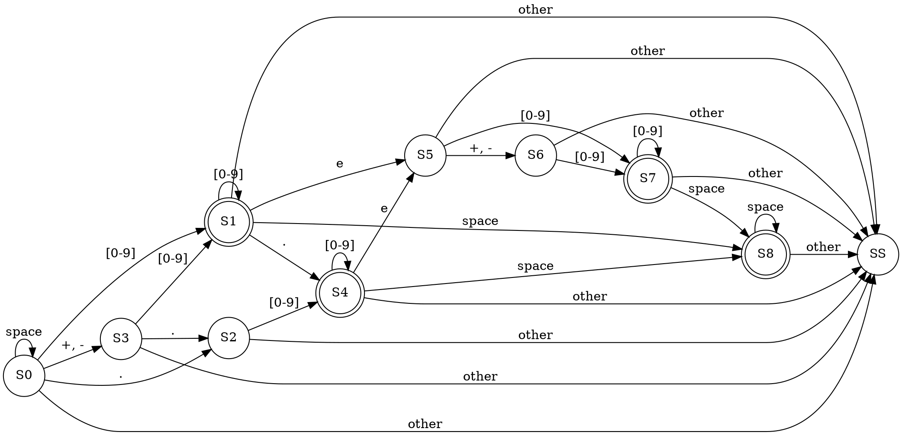

title: Leetcode解题-Valid Number
date: 2015-09-06 10:41:27
tags: [Leetcode, String, 自动机, Graphviz]
categories: [编程题]
---

## 描述
> Validate if a given string is numeric.
>
> Some examples:
> "0" => true
> " 0.1 " => true
> "abc" => false
> "1 a" => false
> "2e10" => true
> Note: It is intended for the problem statement to be ambiguous. You should gather all requirements up front before implementing one.

## 分析
有难度，需要构建状态机。画出来是这个样子的：


上面的图是用[Graphviz][1]画的，非常好用。贴一下上图的dot语言源码:



时间复杂度`O(n)`，空间`O(1)`。

## 代码
### Python
```python
class Solution(object):
    def getCharType(self, c):
        if c == ' ':
            return 1
        elif c == '+' or c == '-':
            return 2
        elif c in '0123456789':
            return 3
        elif c == '.':
            return 4
        elif c == 'e' or c == 'E':
            return 5
        else:
            return 0

    def getAutoMata(self):
        return [
            (-1, 0, 3, 1, 2, -1),
            (-1, 8, -1, 1, 4, 5),
            (-1, -1, -1, 4, -1, -1),
            (-1, -1, -1, 1, 2, -1),
            (-1, 8, -1, 4, -1, 5),
            (-1, -1, 6, 7, -1, -1),
            (-1, -1, -1, 7, -1, -1),
            (-1, 8, -1, 7, -1, -1),
            (-1, 8, -1, -1, -1, -1),
        ]

    def isNumber(self, s):
        """
        :type s: str
        :rtype: bool
        """
        m = self.getAutoMata()
        state = 0
        for c in s:
            t = self.getCharType(c)
            state = m[state][t]
            if state == -1:
                return False
        return state in (1, 4, 7, 8)
```

[1]: http://www.graphviz.org/
